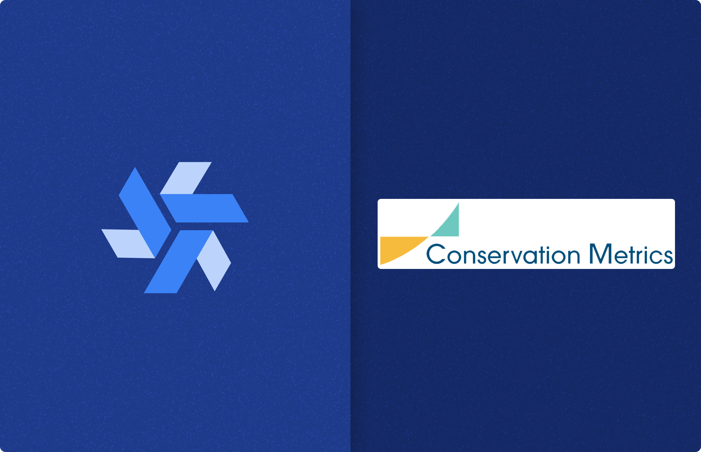
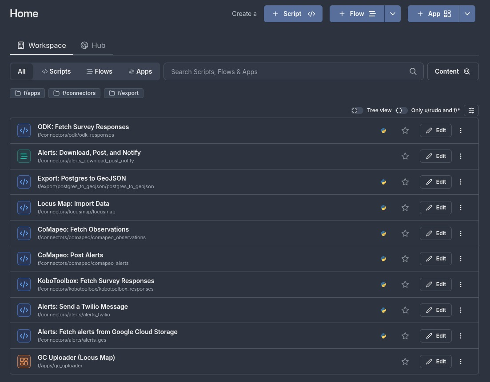
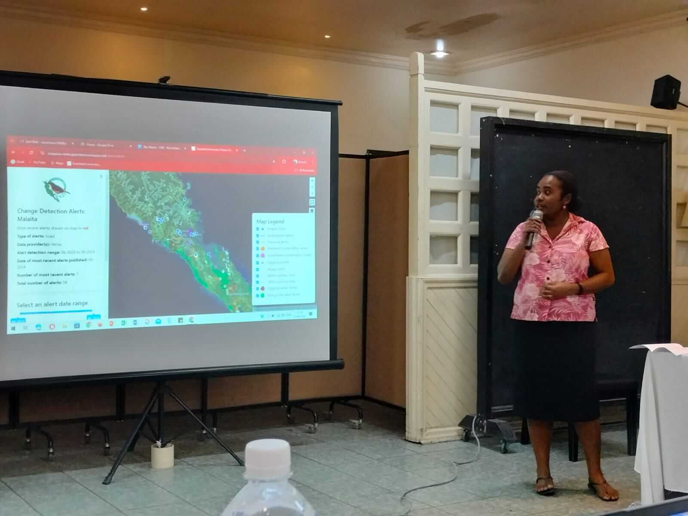

# Windmill for Supporting Indigenous Communities - Conservation Metrics Case Study

> "Windmill is invaluable for our end users, the indigenous communities. As simple as it is to deploy and scale, it saves them hours of work and provides near-instantaneous data access that previously took months of manual work."

 

This testimonial is based on conversations with [Rudo Kemper](https://www.linkedin.com/in/rudo-kemper/) from [Conservation Metrics](https://conservationmetrics.com/). Rudo is leading a program to build free and open-source software for data sovereignty for indigenous communities, in Brazil, Kenya, the Solomon Islands, and elsewhere.

## What before Windmill?

[Conservation Metrics](https://conservationmetrics.com/) works with indigenous communities worldwide to provide tools and systems for environmental monitoring and protection. As part of our [Guardian Connector](https://guardianconnector.net) toolkit, our team needed a workflow orchestrator that could handle data processing from various sources, particularly for centralizing data from many different field data collection applications used by communities, and monitoring illegal activities in protected territories.

Having migrated from [Dagster](https://dagster.io/), we found that Windmill offered the accessibility and ease of use we needed for our small teams and non-technical users. Its intuitive interface and flexibility allowed us to focus on our core mission, rather than spending time on framework configuration or building additional user interfaces.

## How we use Windmill

Our team leverages Windmill for several critical workflows:

### Environmental monitoring pipeline

Our core environmental monitoring workflow integrates with data provided by the Brazilian research institute [Imazon](https://imazon.org.br/en/) or [Global Forest Watch](https://www.globalforestwatch.org/) to monitor changes in forest cover. When potential illegal activities are detected, our system automatically:
- Processes the alert data (including conversion of GeoTIFF images to JPEG for browsing rendering)
- Triggers WhatsApp notifications to local communities
- Posts the alerts to a [CoMapeo](https://www.comapeo.app/) API for offline data collection
- Updates monitoring dashboards
- Logs the events for further analysis

This pipeline has been successfully implemented with community partners in Brazil, Suriname, and the Solomon Islands.

### Data processing and integration

We use Windmill for various [ETL](/docs/core_concepts/data_pipelines) workflows:
- Extracting tabular and binary data from multiple environmental monitoring and field data collection sources (such as [KoboToolbox](https://www.kobotoolbox.org/), [ODK](https://getodk.org/), and [CoMapeo](https://www.comapeo.app/))
- Transforming and processing the data
- Loading results into our databases
- Generating automated reports and alerts

All our scripts are open-source and available in our [GitHub repository](https://github.com/ConservationMetrics/gc-scripts-hub), making it easy for other organizations to adopt similar solutions.

> A Windmill Workspace populated with some of the tools in the GitHub repository.

## Real-world impact

Windmill has enabled us to create tangible impact in protecting indigenous territories:

### Combating encroaching gold mining in the Amazon rainforest

Our system runs daily to detect new alerts about gold mining activities within indigenous territory. When detected, the system provides before/after images and coordinates of the activity. It also integrates field data from tools like CoMapeo, allowing teams to cross-reference remote sensing with ground observations. The automated notifications enable rapid response from local teams, who may alert authorities and law enforcement. This quick response is crucial as small-scale illegal mining often involves mercury, which can contaminate waterways and cause long-term environmental damage.

> _"In 2022, during a mapping expedition, we discovered an illegal mining site inside of one of the Indigenous territories. When we returned from the expedition and investigated the site using satellite imagery, we found out that the mining activity had actually been ongoing for a year already! Now, with this new alerts system, we will be able to know about it within a matter of days or weeks, inform the communities, and alert the authorities to take action. This is an invaluable boost to our ongoing monitoring efforts to keep the region safe from land invasions."_ — one of our partners in Brazil.

### Solomon Islands: preventing illegal logging

In the Solomon Islands, our Windmill-powered monitoring system helped detect and stop logging operations above 400m in elevation — areas that often overlap with Indigenous community lands and were [deemed illegal under the 2018 Sky Islands pledge](https://www.solomonstarnews.com/pm-signs-gov-t-pledge-to-ban-logging-mining/). Having demonstrated the effectiveness of automated environmental monitoring, the system is becoming a national-level methodology for monitoring alerts and has [been received positively by the ministry of the environment](https://mai-maasina.org/change-detection-presentation-to-the-ministry-of-environment/).

> Presentation of alerts dashboard for the Solomons ministry of the environment. [[source](https://mai-maasina.org/change-detection-presentation-to-the-ministry-of-environment/)]

### Real-time dashboards for community-led monitoring

Before Windmill, many of our Indigenous community partners relied on paper-based methods or apps that required manual processing, often taking weeks or months to generate useful insights. Now, we’ve built end-to-end workflows where users collect data or complete surveys in the field, and Windmill automatically retrieves that information every hour. When users open their dashboards, the latest data is ready for the entire village to review that same evening. Already, this has been a game changer for how these community organizations track impact and make decisions.

## Why we chose Windmill

Several key factors made Windmill the right choice for our organization:

- **Accessibility**: The intuitive UI and operator mode allow non-technical users to manage workflows without coding knowledge
- **Open source**: Our scripts remain in raw Python format, making them easily transferable and maintainable
- **Quick implementation**: Small teams can become productive quickly, crucial for organizations with limited resources
- **Community support**: Excellent [documentation](/docs/intro) and responsive community on [Discord](https://discord.com/invite/V7PM2YHsPB)
- **Flexibility**: Easy integration with various data sources and notification systems
- **Portability**: The ability to run raw Python scripts without special formatting means we can easily port our code to other frameworks if needed
- **Low learning curve**: New contributors can quickly understand and work with our codebase without needing to learn a specific framework

## The power of automation for small teams

What makes Windmill particularly valuable for mission-driven organizations like ours is its ability to replace multiple roles that would typically require dedicated staff:

- **Server administration**: Simple deployment and management through [Docker](/docs/advanced/self_host#docker)
- **Workflow orchestration**: Intuitive interface for managing complex data pipelines
- **User management**: [Role-based access control](/docs/core_concepts/roles_and_permissions) for different user types
- **Frontend development**: The built-in UI generation capabilities eliminate the need for separate frontend applications

This has allowed our small team to focus on our core mission of supporting indigenous communities rather than managing complex technical infrastructure.

## Looking forward

We're excited about Windmill's continued evolution and its potential to further empower organizations working in environmental conservation. The upcoming improvements to the app builder will make it even more valuable for our work.

Our experience with Windmill demonstrates how the right tools can amplify the impact of organizations working on critical environmental and social issues, even with limited technical resources.